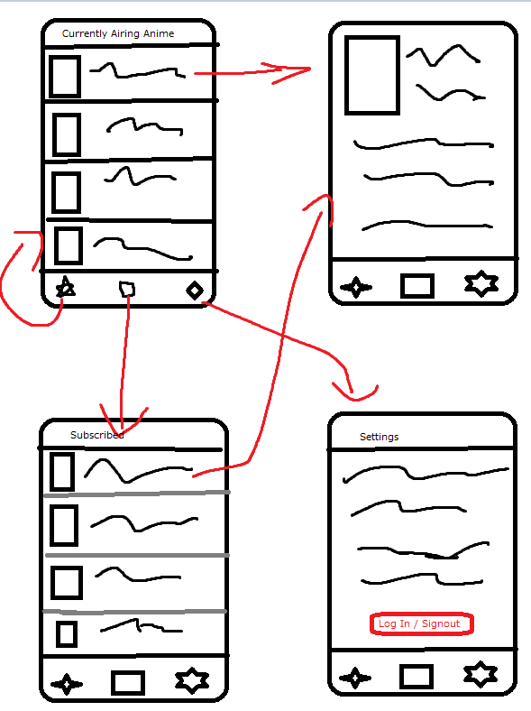
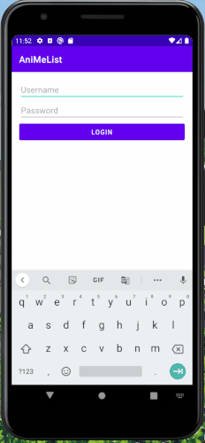

Original App Design Project - README Template
===

# AniMeList


## Table of Contents
1. [Overview](#Overview)
1. [Product Spec](#Product-Spec)
1. [Wireframes](#Wireframes)
2. [Schema](#Schema)
3. [Gifs](#Gifs)

## Overview 
### Description
Subscribe to currently airing anime and get notified when new episodes are released. 

### App Evaluation
[Evaluation of your app across the following attributes]
- **Category:** Utility
- **Mobile:** Primarily mobile, possibly could be a website.
- **Story:** There will be a list of all the currently airing anime then you can choose which ones to subscribe to. There will be a page for your currently subscribed to animes. 
- **Market:** People that are interested in watching and keeping up to date with currently airing animes for the season.
- **Habit:** They can use it on a weekly or a daily basis depending on how many animes they want to watch. 
- **Scope:** Users can add animes to their personal lists to keep track off. It can then evolve into the app recommending users animes based off their personal lists. 

## Product Spec

### 1. User Stories (Required and Optional)

**Required Must-have Stories**

- [x] User registers/logins to have a personal list of what animes they want to subscribe
- [ ] Users can see the all of the currently airing anime
- [ ] User can subscribe to which anime they want to get notified about
- [ ] Settings (Light/Dark Mode)

**Optional Nice-to-have Stories**

* Users can view the top animes overall
* Users can go to other profiles and view which animes they are keeping up to date with
* Users can chat with each other
* Users can rate and review the anime they watched

### 2. Screen Archetypes

* Login 
* Register - User signs up or logs into their account
   * Upon Download/Reopening of the application, the user is prompted to log in to gain access to their profile information to be properly matched with another person. 
   * ...
* Currently Airing Animes Screen
   * Allows user to view the currently airing animes 
* Personal List Screen
   * Allows user to be able to see which animes they have subscribed to and will get notified about.


### 3. Navigation

**Tab Navigation** (Tab to Screen)

* Currently Airing Animes
* Subscribed Animes
* Settings and Sign Out

**Flow Navigation** (Screen to Screen)

* Log-in -> Account creation if no log in is available
* Currently Airing Animes Screen -> Anime Details
* Personal List -> Anime Details
* Settings -> Toggle settings

## Wireframes
[Add picture of your hand sketched wireframes in this section]


### [BONUS] Digital Wireframes & Mockups

### [BONUS] Interactive Prototype

## Schema 
### Models
#### Anime

   | Property      | Type     | Description |
   | ------------- | -------- | ------------|
   | animeId       | Integer  | The unique id of each anime |
   | title         | String   | title of the anime |
   | image         | Object   | cover image of each anime |
   | rating        | Integer  | The score users rated the anime |
   | synopsis      | String   | A summary of each anime |
   | subscribe     | Boolean  | Determines if user subscribed to anime  |

#### User/Profile


   | Property          | Type          | Description |
   | -------------     | --------      | ------------|
   | userId            | Integer       | The unique id of each user |
   | username          | String        | The username of the user |
   | subscribed_animes | List<Anime>   | The list of subscribed animes from user |
   
### Networking
#### List of network requests by screen
   - Currently Airing Anime Screen
      - (READ/GET) Query all the animes currently airing this season.
         ```swift
         let query = PFQuery(className:"Anime")
         query.order(byDescending: "title")
         query.findObjectsInBackground { (anime: [PFObject]?, error: Error?) in
            if let error = error { 
                print(error.localizedDescription)
            } else if let anime = anime {
                print("Successfully retrieved \( Anime.count) Anime.")
            // TODO: Do something with anime...
             }
         }

         ```
      - (Create/POST) Subscribe to an anime.
      - (Delete) Unsubscribe to an anime.
   - Anime Details Screen
      - (READ/GET) Query all the details about the anime.
         ```swift
         let query = PFQuery(className:"Details")
         query.whereKey("anime", equalTo: currentAnime) 
         query.order(byDescending: "title")
         query.findObjectsInBackground { (anime: [PFObject]?, error: Error?) in
            if let error = error { 
                print(error.localizedDescription)
            } else if let anime = anime {
                print("Successfully retrieved \( Anime.count) Anime.")
            // TODO: Do something with anime...
             }
         }

         ```
      - (Create/POST) Subscribe to an anime.
      - (Delete) Unsubscribe to an anime.
   - User Anime List
      - (READ/GET) Query all the animes the user subscribed to.
         ```swift
         let query = PFQuery(className:"Anime")
         query.whereKey("subscribed", equalTo: true) 
         query.order(byDescending: "title")
         query.findObjectsInBackground { (anime: [PFObject]?, error: Error?) in
            if let error = error { 
                print(error.localizedDescription)
            } else if let anime = anime {
                print("Successfully retrieved \( Anime.count) Anime.")
            // TODO: Do something with anime...
             }
         }

         ```
      - (DELETE) Unsubscribe to an anime.
   - Settings Screen
      - (UPDATE/PUT) The option to put the screen on light or dark mode.
- [OPTIONAL: List endpoints if using existing API such as Yelp]

## Gifs

